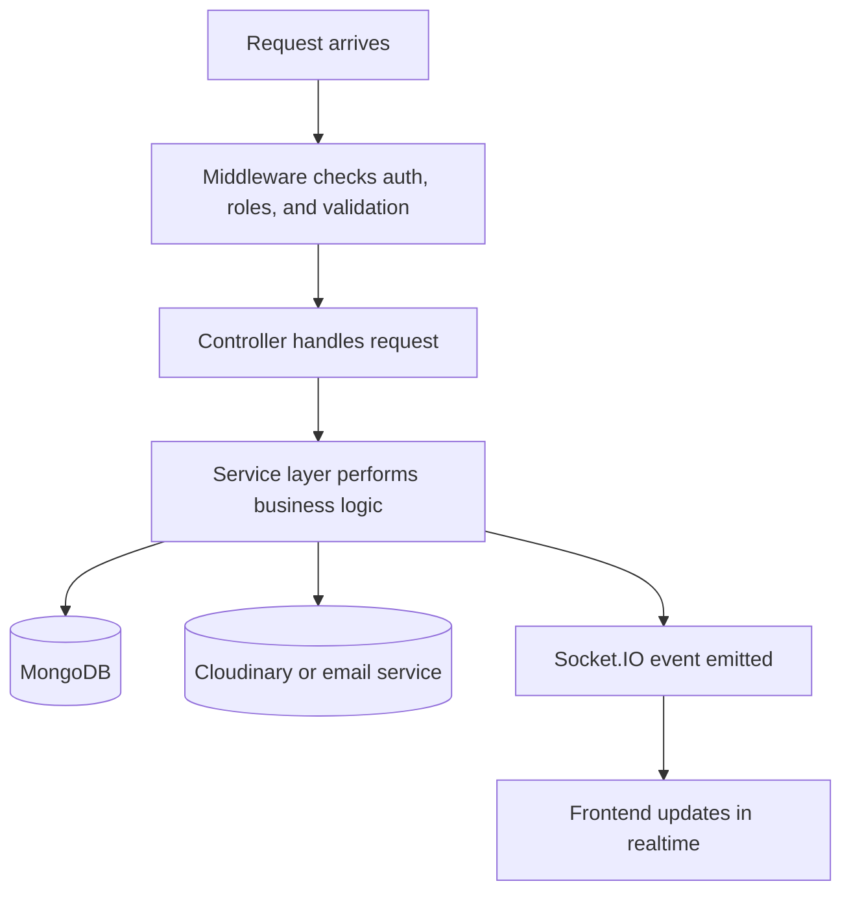

# Backend

Express and MongoDB API for the Real-Time Crime Reporting platform.

## What It Does

- Authenticates users with JWT and refresh tokens
- Manages crime reports, alert subscriptions, media, analytics, and admin operations
- Emits realtime events through Socket.IO
- Stores data in MongoDB and report media in Cloudinary

## Tech Stack

- Node.js
- Express 5
- MongoDB and Mongoose
- Socket.IO
- JWT
- bcrypt and bcryptjs
- Multer
- Cloudinary
- Nodemailer
- Winston
- Helmet and CORS

## Folder Overview

```text
config/       app and environment configuration
controllers/  request handlers
middleware/   auth, validation, upload, and error handling
models/       MongoDB models
routes/       API route definitions
services/     business logic and integrations
sockets/      realtime event handlers
utils/        shared helpers
validations/  request schemas
```

## Flow



## Main API Groups

- `/api/v1/auth`
- `/api/v1/crimes`
- `/api/v1/users`
- `/api/v1/admin`
- `/api/v1/alerts`
- `/api/v1/media`
- `/api/v1/analytics`

## Environment Variables

Required in `backend/.env`:

```env
PORT=5000
NODE_ENV=development
MONGO_URI=
JWT_SECRET=
REFRESH_SECRET=
CLOUDINARY_CLOUD_NAME=
CLOUDINARY_API_KEY=
CLOUDINARY_API_SECRET=
EMAIL_HOST=
EMAIL_PORT=
EMAIL_USER=
EMAIL_PASS=
EMAIL_FROM=
FCM_SERVER_KEY=
CLIENT_URLS=http://localhost:5173
RESET_LINK_BASE_URL=http://localhost:5173
VERIFY_LINK_BASE_URL=http://localhost:5173
```

## Run It

```bash
npm install
npm run dev
```

## Scripts

- `npm run start`
- `npm run dev`
- `npm run seed:demo`

