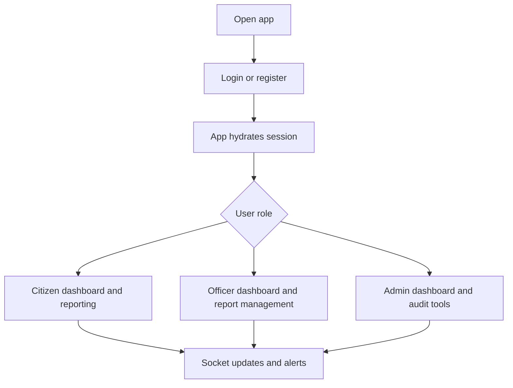

# Frontend

React and Vite client for the Real-Time Crime Reporting platform.

## What It Does

- Handles authentication and role-based navigation
- Lets citizens report incidents and view their reports
- Lets officers manage assigned reports
- Lets admins monitor users, reports, and audit logs
- Shows location-aware maps, alerts, and dashboard analytics

## Tech Stack

- React 19
- Vite
- React Router DOM
- Zustand
- Framer Motion
- Tailwind CSS
- Leaflet and React Leaflet
- React Hook Form
- Zod
- Axios
- Socket.IO Client
- Recharts

## Main User Flow



## Key Screens

- Login, register, forgot password, and reset password
- Citizen home, map, report crime, my reports, alerts, and profile
- Officer dashboard and report management
- Admin dashboard, users, reports, and audit logs

## Environment Variables

Create `frontend/.env` with:

```env
VITE_API_URL=http://localhost:5000/api/v1
VITE_SOCKET_URL=http://localhost:5000
VITE_APP_NAME=CrimeWatch
VITE_GOOGLE_MAPS_KEY=your_google_maps_key
```

## Run It

```bash
npm install
npm run dev
```

## Scripts

- `npm run dev`
- `npm run build`
- `npm run lint`
- `npm run preview`

## Notes

- The client expects the backend API and Socket.IO server to be running.
- Keep local environment files out of GitHub.
